# Data Structure and Algorithm Visualizer
 

A program made in Java that visualizes common data structures and some common sorting and graph algorithms. This was a group project in 2nd year of my Undergraduate studies

## Data Structures

## Stack
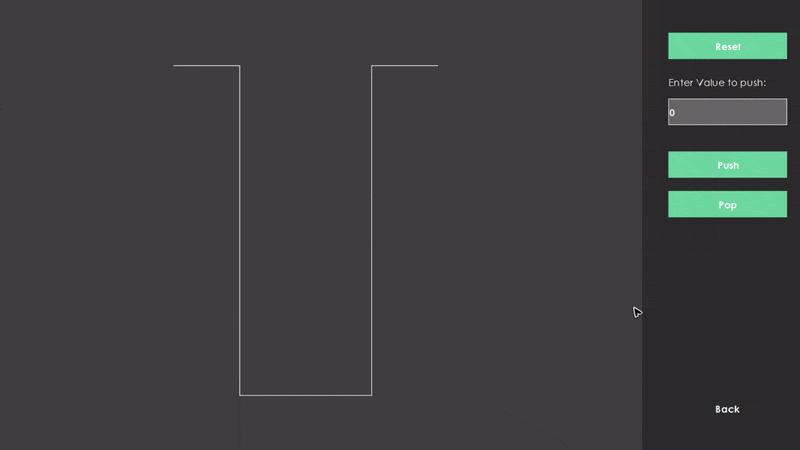

## Queue
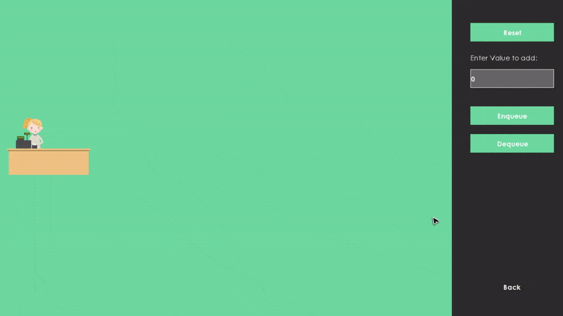

## Binary Search Tree

## Array
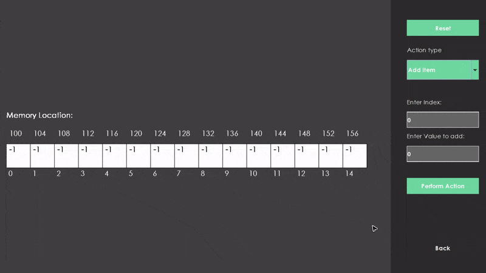

## Algorithms

## Sorting Algorithms
### Bubble Sort
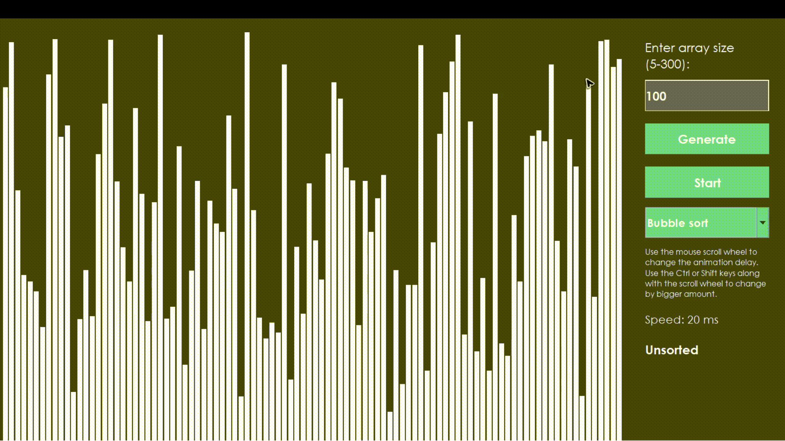

### Insertion Sort
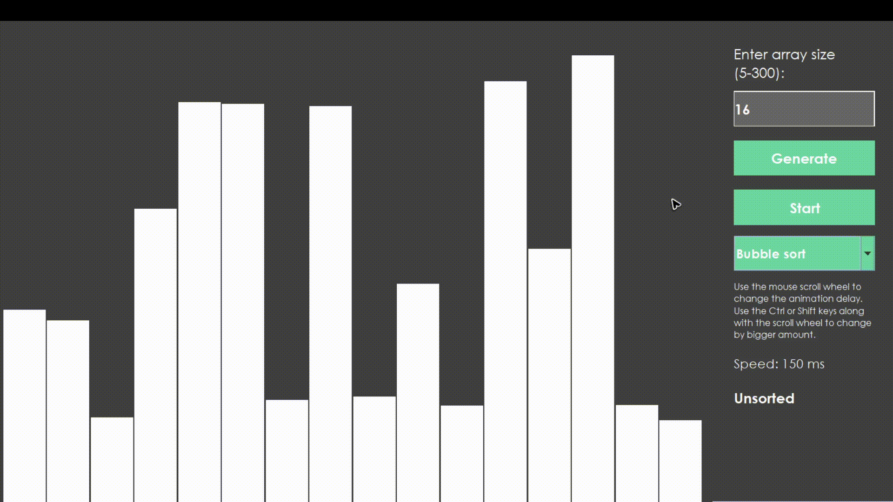

### Selection Sort
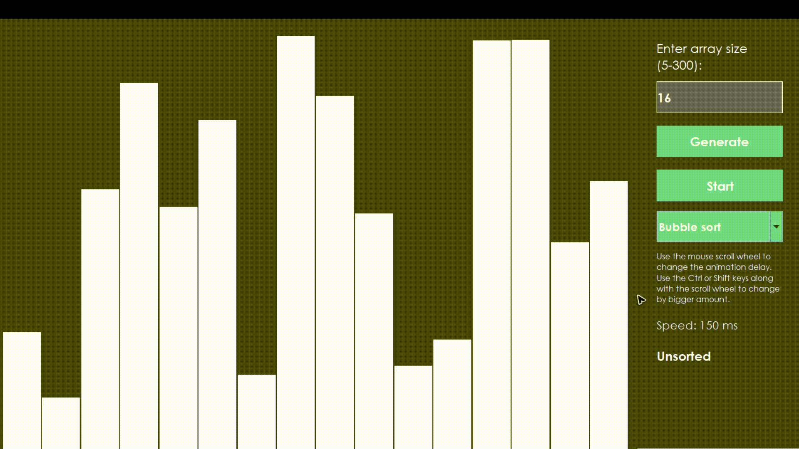

### Merge Sort
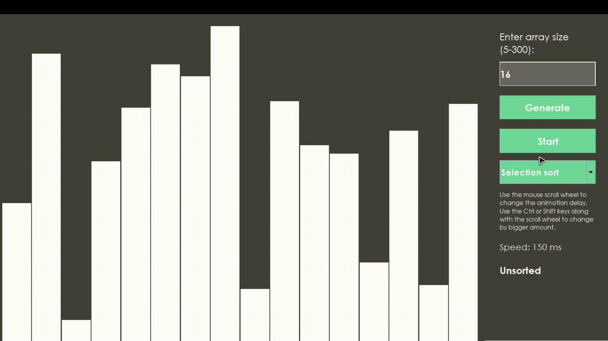

## Graph Algorithms
### Depth First Search
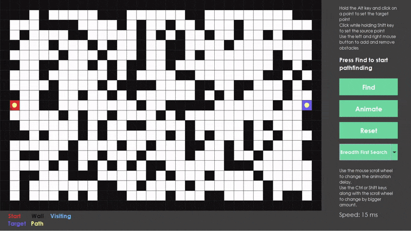

### Breadth First Search
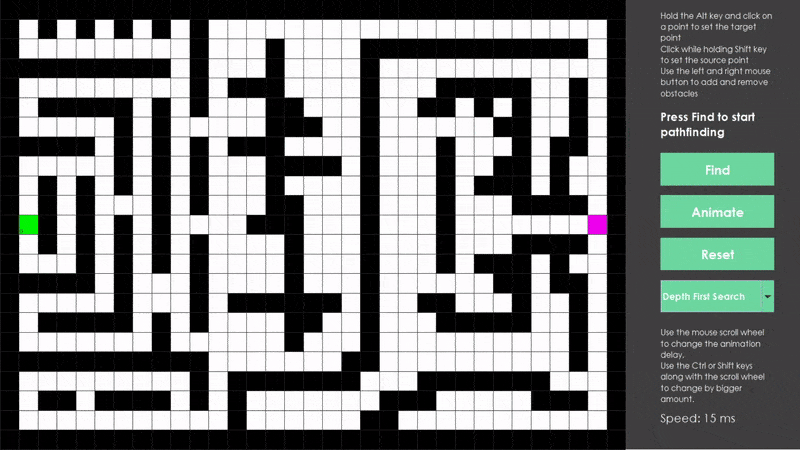

### Dijkstra
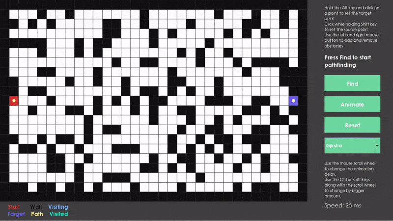

## Search Algorithms
### Linear Search
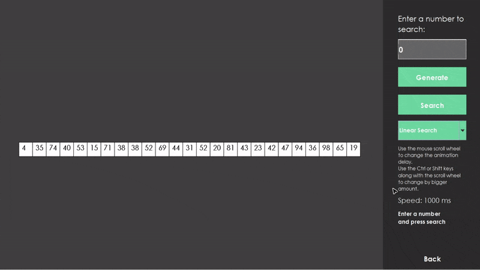

### Binary Search
